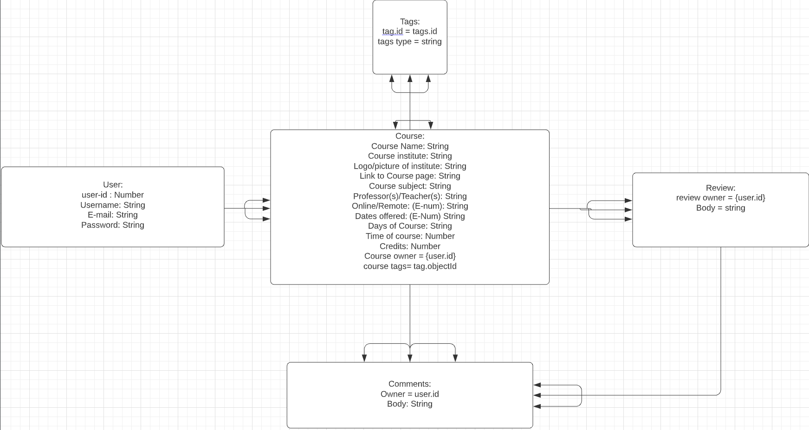
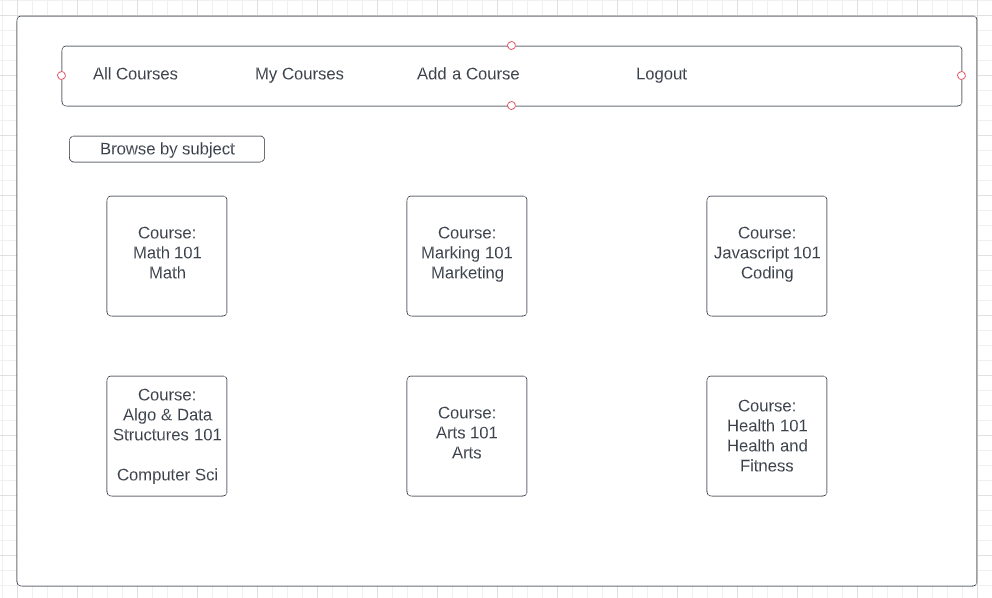

# CourseSearch-Frontend

> Back-end link of project can be found here: https://github.com/Chrislee1996/CourseSearch-Backend

# User story

* The main inspiration of this project came back when I was in undergrad and I wanted to take some online courses for credits so I could graduate in time. However, I had trouble looking up if certain certain classes information while also, having to research beyond the class itself such as looking up the material taught and how the professor was in terms of teaching. This app will allow users to search up courses and determine if they want to take the course. This app will also allow users to find courses that will just simply help their general knowledge outside of college courses (such as courses from Udemy)

* As a user, I want to be able to sign-up or login if I already have an account

* As a user, I want to see a list of courses and what material is taught. From this, when clicking on the course info, I want more detailed information regarding the course such as if it is remote or online, the professor, what they teach and the amount credits offered.

* As a user, I want there to be a external link if I want to take the course and the link will re-direct me to the course page

* As a user, I want to be able to add a course to the website to help other students, adding a course will include details such as again, remote/online and the professor info. 

* As a user, I want to be able to update a course I added in case of any material change or professor change

* As a user, I want to be able to add comments to the course page to give my thoughts on the course and professor.

* As a user, I want to be able to delete my own course that I added just in case the course is no longer offered. 

## MVPs of this project

* Users should be able to sign-up, login and logout

* See all courses added so far with details regarding the course

* Users can create a course and also add a link to the course itself

* Creator of the course and update/delete the course

* Users can comment on the course on their experience so far/after

* Users can filter courses that they added themselves

* Users can filter out if the courses are from a college insitute or not

# Stretch goals 

* Users being able to upload pictures proof that they attended the course via comments

* A category bar that will filter courses by subject (ex. math, arts, buisness, etc..)

* Search bar that will filter courses by school

# ERD

# Wire-frames

* Signup page

* Login Page

* Index Page

* Show Page

* Updating course

* My courses

# Tech Stack 

* React.js

* Javascript

* Python

* Django 

* PostgresSQL

